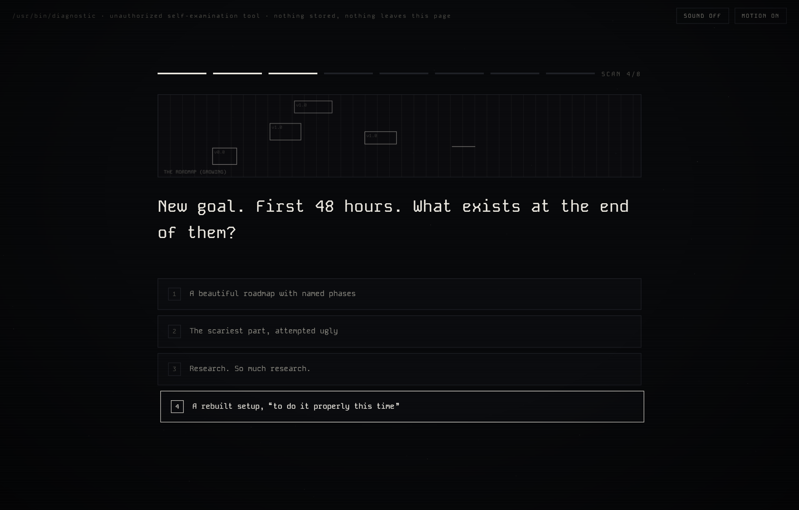
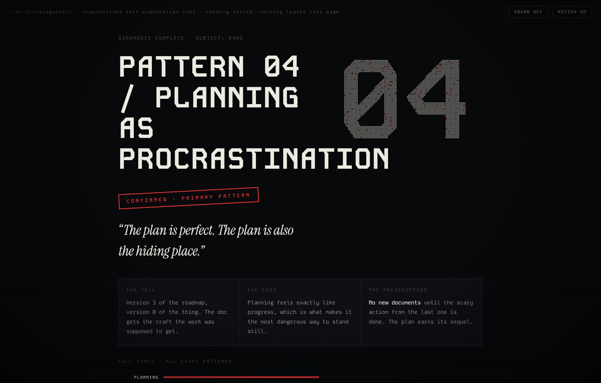

# PATTERNS.EXE 🩻

**Eight questions. One verdict. No mercy setting.**

A self-sabotage diagnostic for builders. It asks eight uncomfortable questions, scores you against eight real failure patterns, and stamps a verdict you can download and share. Blunt by design: the kind version doesn't work.

**Run it:** https://patterns-exe.vercel.app

## The eight patterns

01 The Comfort Trap · 02 Building Instead of Selling · 03 The 80% Problem · 04 Planning as Procrastination · 05 Pride Blocking Help · 06 The Rebuild Loop · 07 Outsourced Identity · 08 The Broken Clock

They come from a real audit: the kind a builder runs on himself at 3 AM after a year of "busy." The patterns are real. The wording is the part that hurt.

## The craft

Every question is accompanied by a **kinetic vignette that behaves like the pattern it interrogates**:

- a progress ring that draws beautifully to 80% and dies, every time
- a tower that stacks, holds a beat, and collapses into "FRESH START #41"
- a bridge that retracts at 90% of the way across
- blueprint boxes that keep redrawing while nothing ever fills
- a clock hand that limps, panics, and runs backwards
- particles that go still and dim the moment they reach the comfort zone (move your pointer: discomfort wakes them)

Plus: a synthesized WebAudio layer (room hum, typewriter ticks, scan sweeps, the stamp thud — zero audio assets), a particle-assembled verdict numeral, a full eight-pattern trace, downloadable 1080×1350 verdict cards, and shareable deep links (`/#p4` opens a shared dossier).

## Engineering notes

- Plain JS, four modules, zero dependencies, zero build step
- All FX are hand-rolled 2D canvas (DPR-aware, motion-toggleable; the motion toggle is explicit because OS `prefers-reduced-motion` flags lie on real machines)
- Nothing is stored, nothing leaves the page: no analytics, no network calls, the name you type only ever touches your own canvas
- `_verify.py` is a Playwright harness that plays three full personas through the quiz, checks the scoring diverges, downloads a card, opens a deep link, and screenshots every scene on desktop + mobile

## Run locally

Open `index.html`. That's it.

---

Built by [Asadulelah](https://github.com/Asadulelah). If the verdict stung, it was probably right.
